---
### 👉作者QQ ：1556708905 微信：zheng0123Long (支持修改、部署调试、定制毕设)

### 👉接网站建设、小程序、H5、APP、各种系统等

### 👉选题+开题报告+任务书+程序定制+安装调试+ppt 都可以做
---

**毕业设计所有选题地址 [https://github.com/zhengjianzhong0107/allProject](https://github.com/zhengjianzhong0107/allProject)**

**博客地址：[https://blog.csdn.net/2303_76227485/article/details/128664176](https://blog.csdn.net/2303_76227485/article/details/128664176)**

**视频演示：[https://www.bilibili.com/video/BV18o4y1P75t/](https://www.bilibili.com/video/BV18o4y1P75t/)**

## 基于Springboot的房屋租赁系统(源代码+数据库)

## 一、系统介绍

本项目分为管理员、经纪人、维修员、普通用户四种角色

管理员角色包含以下功能：

- 房源管理
  
  所有房源、待审核房源、添加房源、我的房源、房源出租

- 账户管理
  
  用户管理、员工管理

- 统计管理
  
  出租量统计，出租金额统计

- 收租管理
  
  已出租房源，待交租房源，已交租房源

- 房屋报修管理

用户角色包含以下功能：

- 看房、关注房源、联系中介

- 个人中心
  
  关注房源列表、发布房源列表、我的租房、个人资料、已（未）交租房源

经纪人角色包含以下功能：
-房源管理、统计分析

维修员角色包含以下功能：
-房屋报修

## 二、所用技术

后端技术栈：

- springboot
- mybatis
- mysql

前端技术栈：

- vue
- elment-ui
- echarts
- html

## 三、环境介绍

基础环境 :IDEA/eclipse, JDK 1.8, Mysql5.7及以上,Maven

源码+数据库脚本

所有项目以及源代码本人均调试运行无问题 可支持远程调试运行

## 四、页面截图

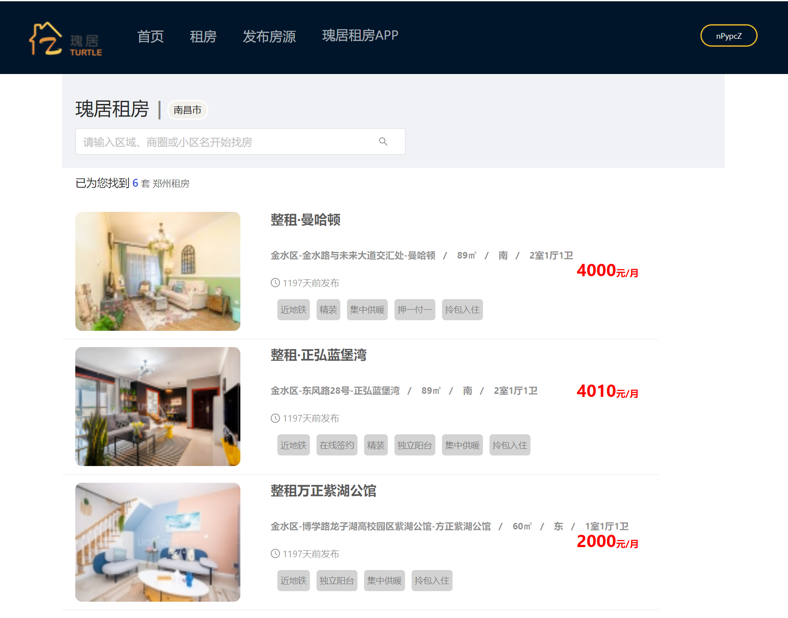

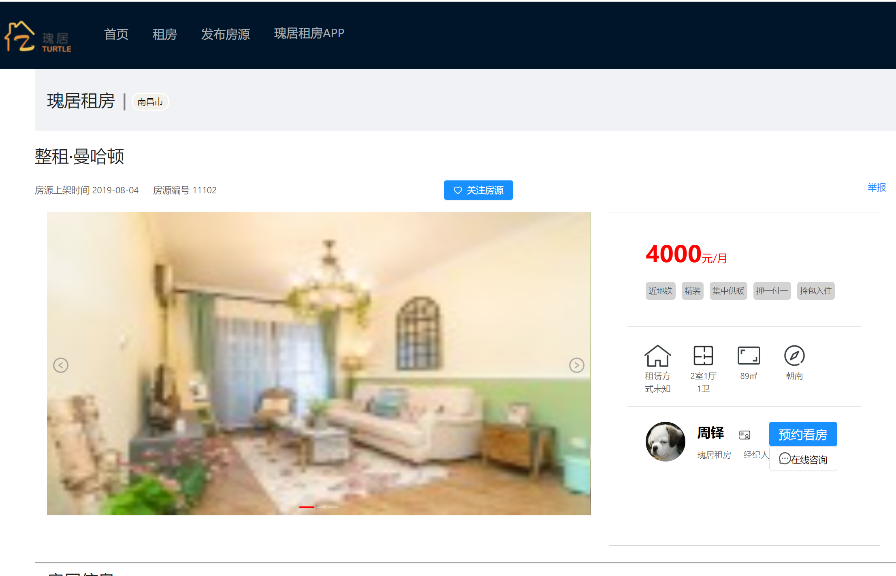

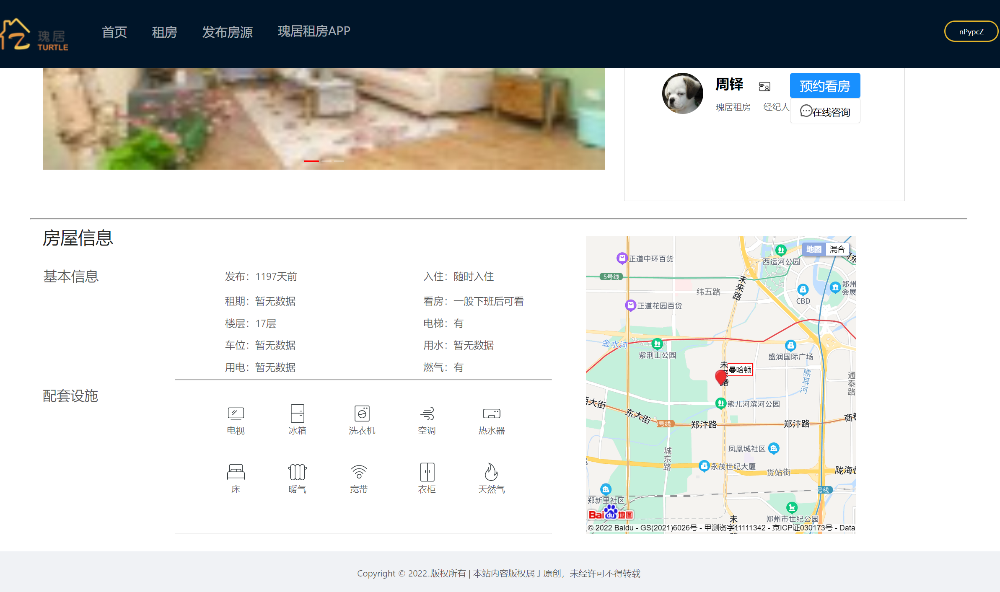

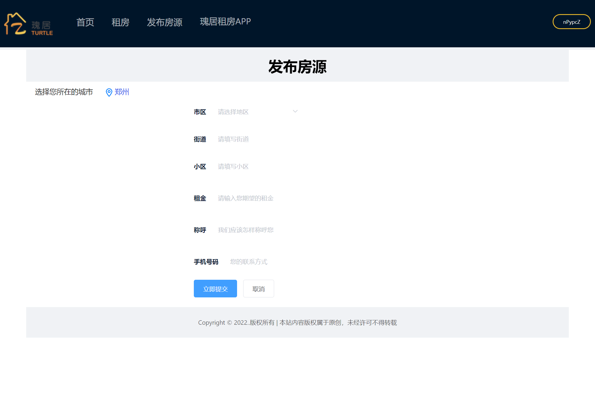

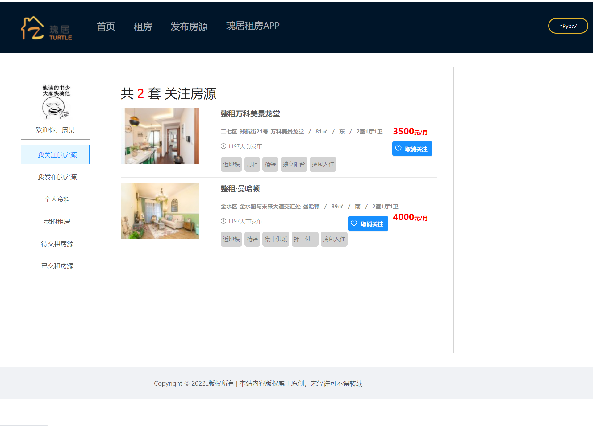

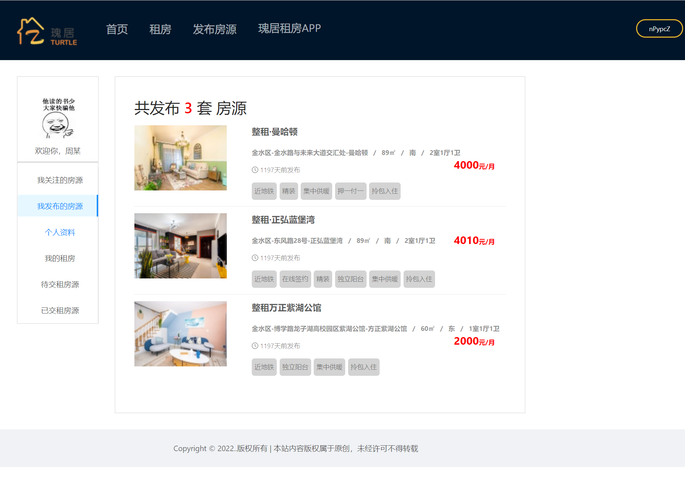

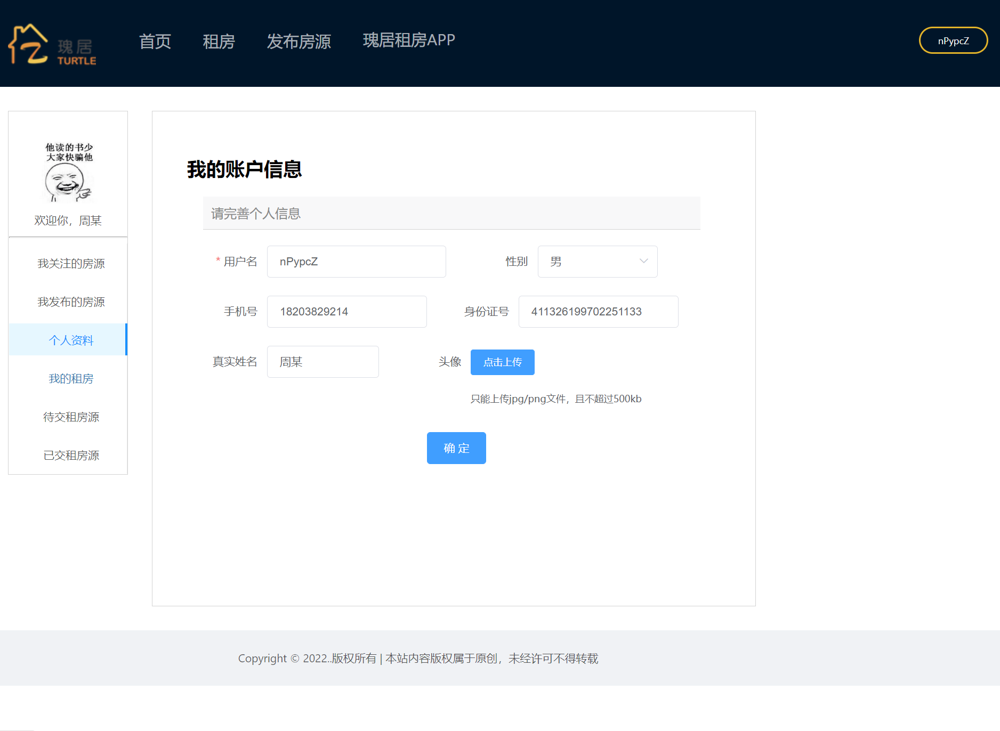

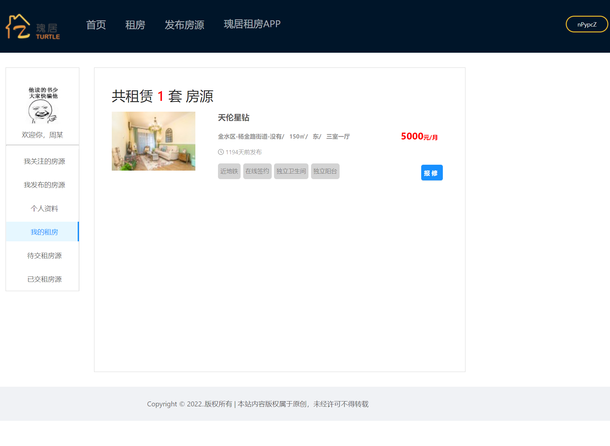

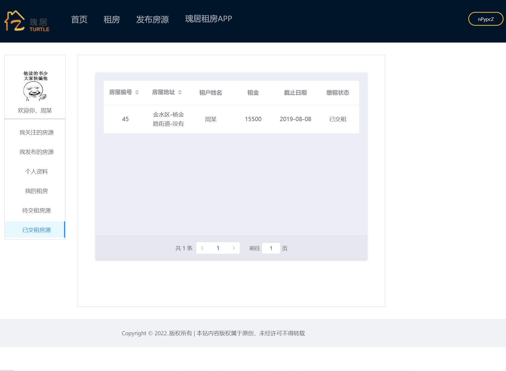

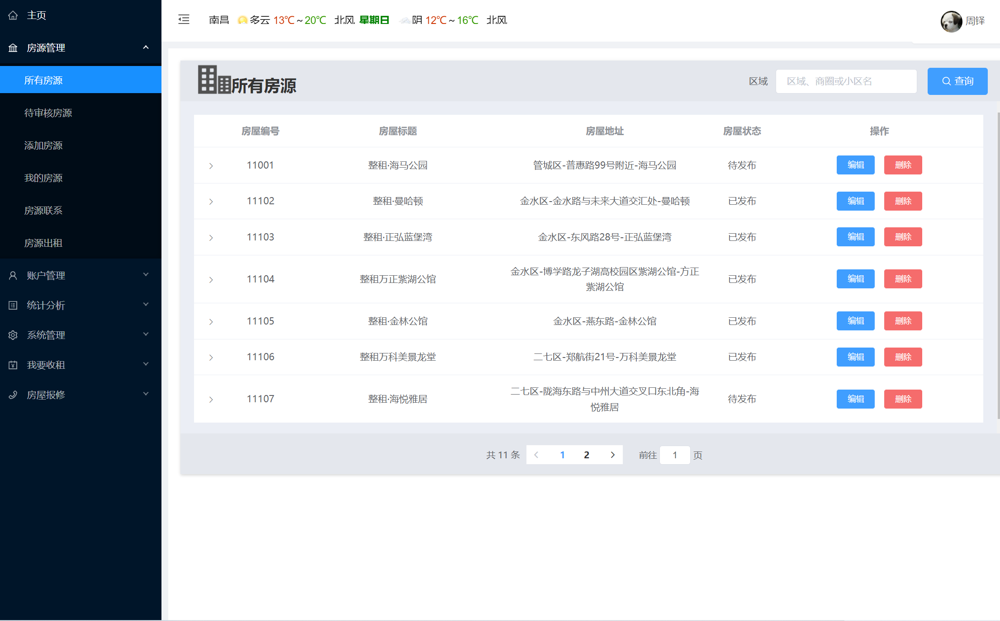

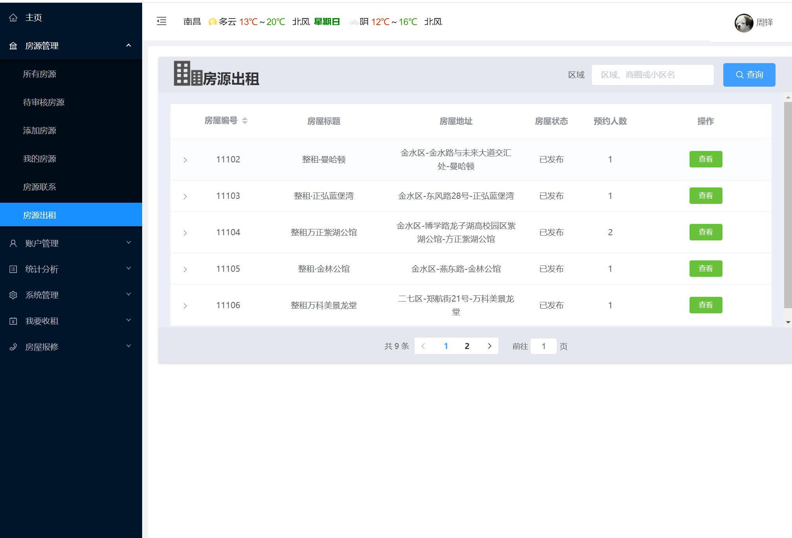

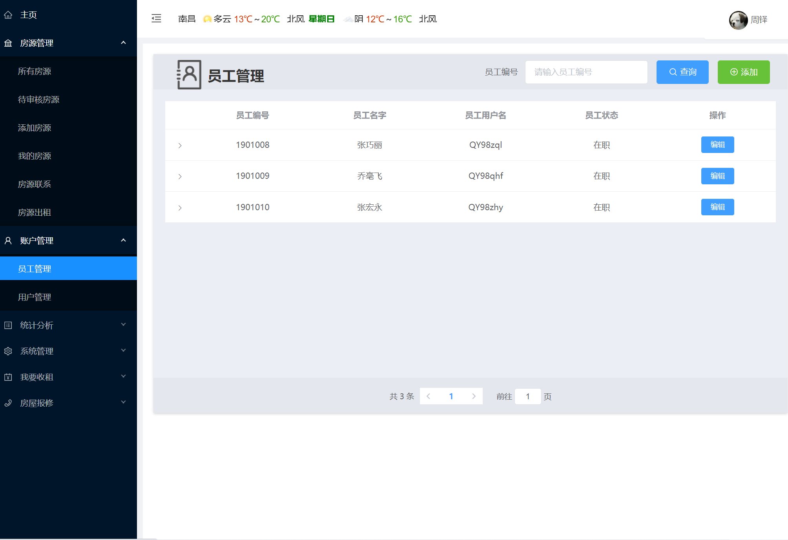

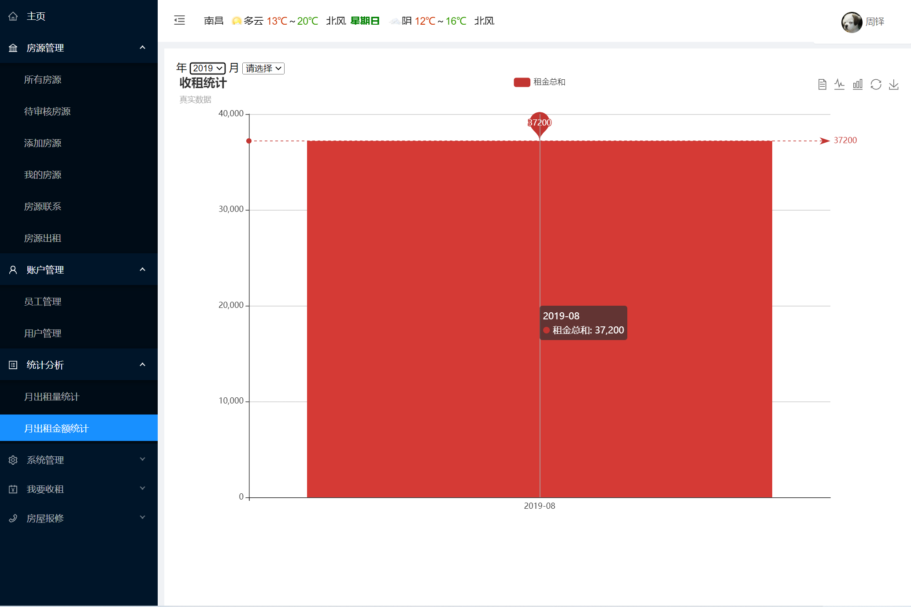

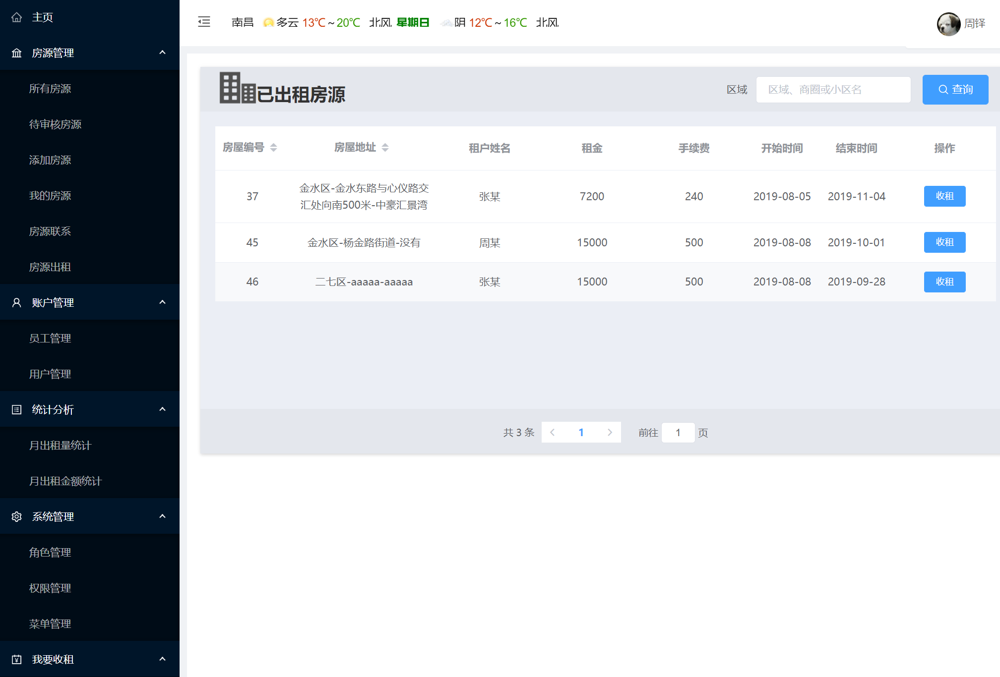

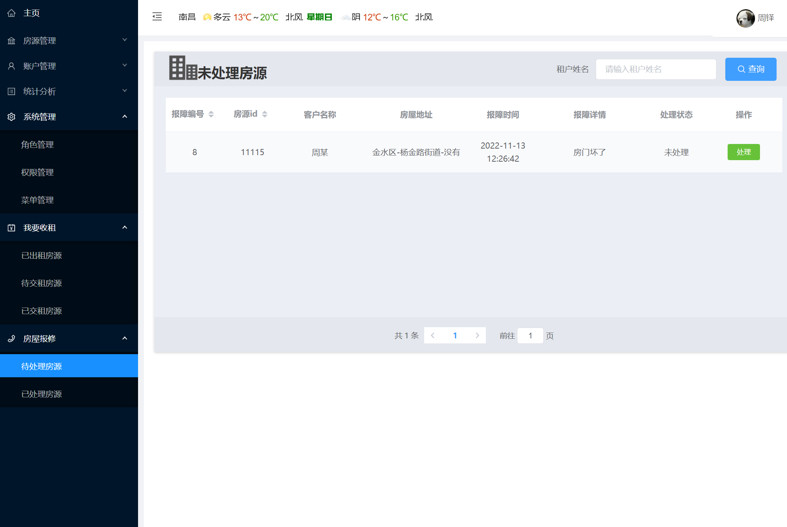

## 五、浏览地址

前台首页：
http://localhost:8053/page/index.html
后台首页：
http://localhost:8053/page/backstage/blogin.html

用户账号：18203829214   密码：123456
管理员账号：QY98zd      密码：123456
经纪人账号：QY98zql     密码：123456
维修员账号：QY98zhy     密码：123456

## 六、安装教程

1. 使用Navicat或者其它工具，在mysql中创建对应名称的数据库，并导入项目的sql文件；

2. 使用IDEA/Eclipse导入项目，若为maven项目请选择maven;
   
   若为maven项目，导入成功后请执行maven clean;maven install命令，然后运行；

3. 修改application.yml 里面的数据库配置和redis.properties的redis配置

4. 启动项目后端项目
